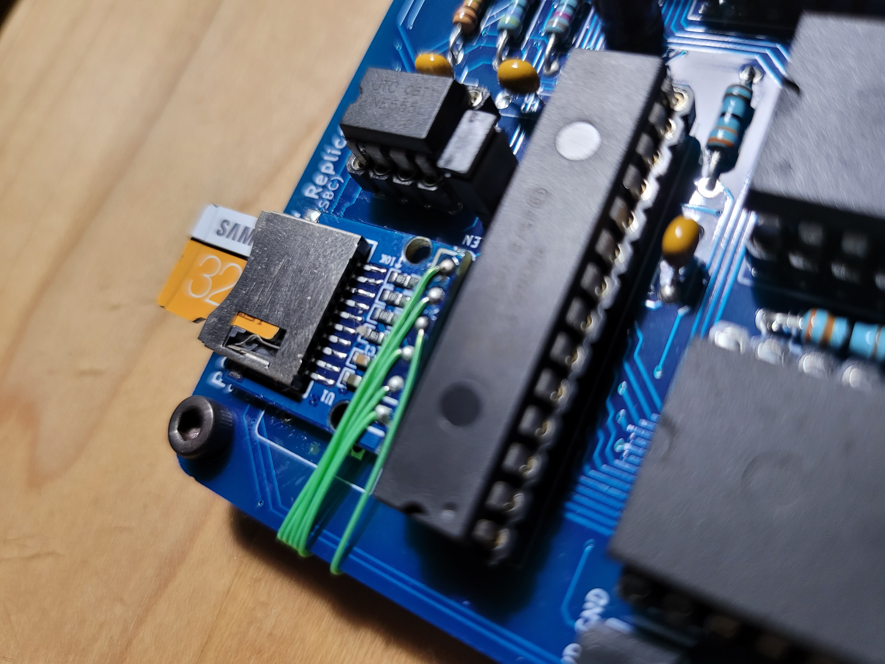
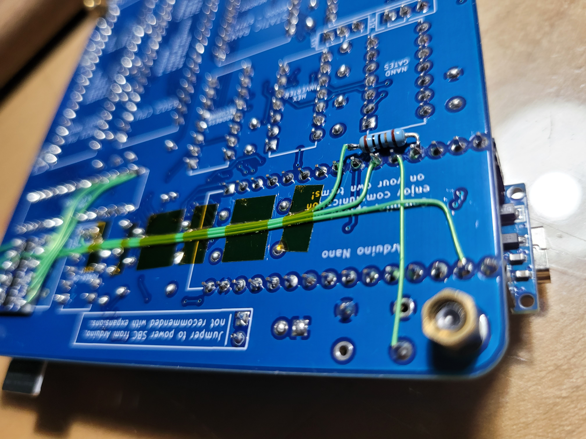
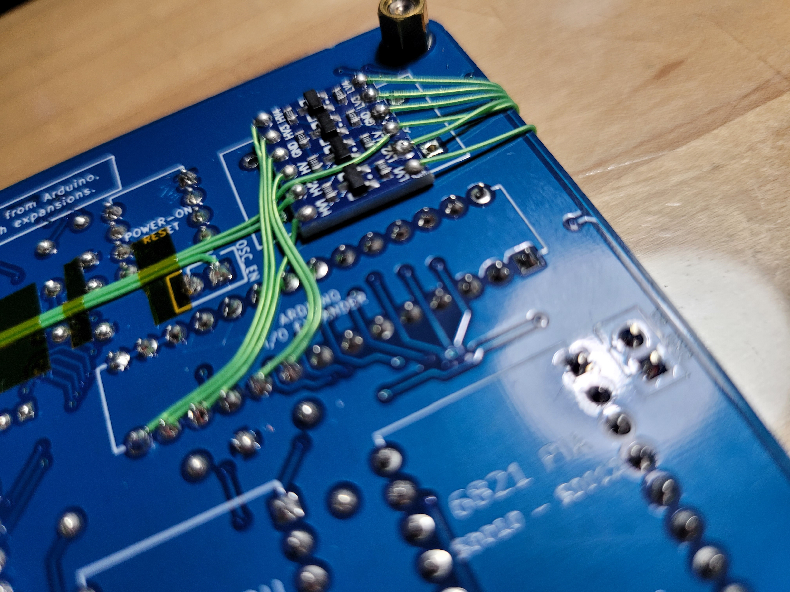
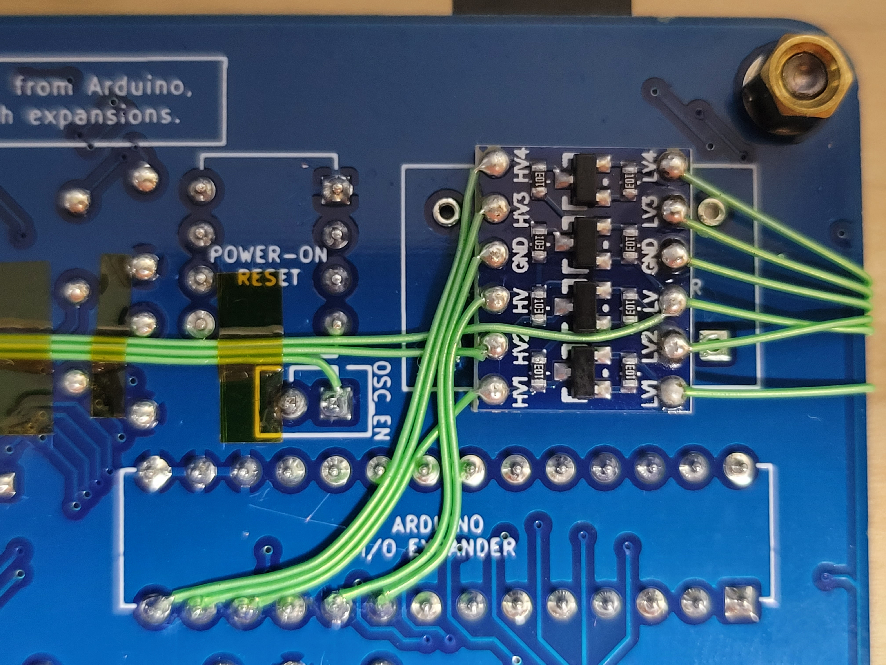
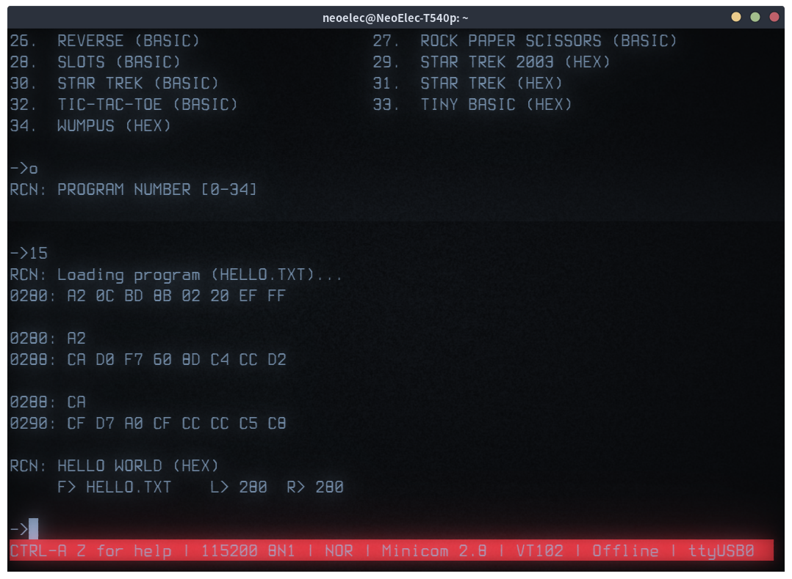

# Raccoon's Alternative PIO for RC6502

## Features (wo/ HW Mod)
- <code>beginClassic()</code> should be called in <code>setup()</code>.

```c++
void setup(void)
{
  RC6502Pio.beginClassic();
}
```

- ISR and State Pattern based 'KBD_READY' handling.


## Features (w/ HW Mod)
- <code>begin()</code> should be called in <code>setup()</code>.

```c++
void setup(void)
{
  RC6502Pio.begin();
}
```

- CSV based 'Program Loader'. You can load 'HEX' files from the storage (micro-sd).
- Built-in 1MHz Clock Generator (not PIN6. PIN9 is used instead of it.)

## HW Modification
- Remove 'X14' - 1MHz Clock Oscillator
  - Install 'Micro-SD Slot' and 'Level Shifter' at here.
- Short or Connect using a small register (10Ohm is used) between 'CLOCK' and 'PIN 9' of Arduino.
- Connect 'PIN 8' of Arduino to 'RESET'.
- Connect Micro-SD card module uisng a 'SPI' interface.
  - 'PIN 7' is used for 'CS'
- Pictures








## Screenshots





